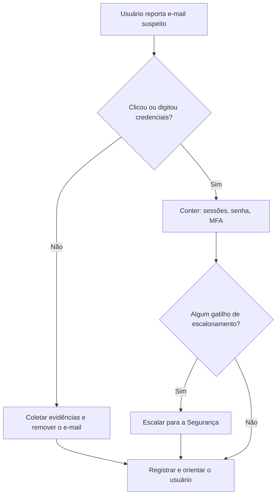

# Fluxograma de decisão

```mermaid
flowchart TD
    A[Usuário reporta e-mail suspeito] --> B{Clicou ou digitou credenciais?}
    B -- Não --> C[Coletar evidências e remover o e-mail]
    B -- Sim --> D[Conter: sessões, senha, MFA]
    D --> E{Algum gatilho de escalonamento?}
    E -- Sim --> F[Escalar para a Segurança]
    E -- Não --> G[Registrar e orientar o usuário]
    C --> G
    F --> G
```
